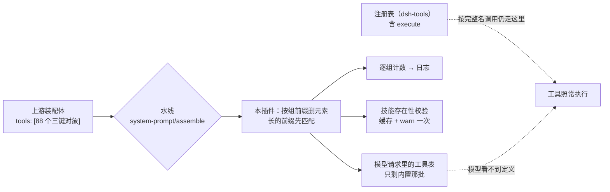

# dsh-host-tool-layering

> **v0.1.0** · 宿主插件（DSH desktop profile）· 状态：**已装机并在本机运行**（装机三步见 §11，逐项复核清单见 §13）
> 一句话：**不做任何检测，任何会话一律把配置里各组前缀下的工具从"模型可见工具表"里摘掉，并逐组计数。**

| | |
|---|---|
| 水线挂钩点 | `system-prompt/assemble`（`{ global: true, prepend: true }`） |
| 识别规则 | 配置面 `groups` 里每组一个前缀；**前缀重叠时长的先匹配**，每个工具恰好算给一组 |
| 默认摘除量 | `cua` 56 个 / 24,832 token ＋ `godot` 39 个 / 9,599 wire token |
| 配置面 | `diag`（布尔，默认 `false`）＋ `groups`（组表：每组 = 前缀 + 说明技能） |
| 判定输入 | **无** —— 不读会话 cwd、不碰工作区文件、不看标记文件；只读 `~\.dsh\skills\<skill>\SKILL.md` 的**存在性** |
| 代码 | `lib/config.js` + `lib/assembly.js` + `lib/skills.js` + `lib/index.js` |
| 测试 | `test/*.test.mjs`，**68 个用例**，`node --test` 全绿（不启动 dsh） |
| 血缘 | `dsh-host-godot-tool-layering` v0.2.0 的**泛化**：把"写死一个前缀 + 一个技能"抽成配置面的一张组表 |

---

## 1. 它做什么

```
装配体（上游每步重建的 { name, description, parameters } 列表）
        │
        ├── 名字命中某一组的前缀（重叠时取最长）→  摘掉，并记到该组名下
        └── 其它工具                              →  一个不动、顺序不变、对象引用不变
        │
        ├── 逐组计数：present=56 removed=56 (cua) / present=0 removed=0 (godot)
        └── 校验每组配的说明技能是否存在（不存在 → warn 点名）
        │
返回新 assembly（有摘除时）／ 原样返回同一个引用（无可摘项时）
```

模型侧从此看不到这些工具的工具定义，改成由**技能**当说明书，按**完整工具名**
（`cua_driver_native__<原始名>` / `mcp__godot_use__<原始名>`）直接调用 ——
技能本身由另一路维护，不属于本插件；本插件只负责"**摘掉之后那本说明书得真实存在**"。



**为什么值得做**（本机实测）：
- CUA 那 56 个工具占 `cua_driver_native__` 一整个命名空间，**每轮白付 24,832 token**（2026-10-04 口径）；
- godot 39 个 = 9,599 wire token，613 个会话存档里只有 **4.1%** 的会话用过它、曝光过它的 232 个会话里 **92.7% 一次都没用**（2026-09-14 口径）；
- 两组的共同点：**用得少、但每次请求都要完整付一遍**，而"有哪些工具、怎么调"完全可以按需由技能提供。

---

## 2. 挂载点与机制依据

行号以 **live 树**为准：`%USERPROFILE%\.dsh\profiles\node_modules\@deepseek-ai\`
（Junction → `~\node_modules\@deepseek-ai\dsh\node_modules\@deepseek-ai\`）。
⚠ 本机有**三棵** dsh 树，行号不可混用；顶层 `%USERPROFILE%\node_modules\@deepseek-ai\` 是陈旧的 0.1.2-alpha.3。

| 事实 | 依据 |
|---|---|
| 水线返回值权威，可以改写最终 `assembly.tools` | `dsh-system-prompt\lib\index.js:351`；文档串 `:302` |
| 每轮触发点（每个模型步之前） | `dsh-agent-loop\lib\index.js:890`（`ReactLoopAgent.preStep` 内） |
| 装配体里的工具只有 `{name, description, parameters}`，**没有 `execute`** | `dsh-system-prompt\lib\index.js:322-326` |
| 顺序规范化 `orderTools` 在**水线之前** ⇒ 水线里删元素不触发保留名/未注册名校验 | 同文件 `:348`、`:83-86` |
| 执行解析走注册表视图，**从不读装配体** | `dsh-tools\lib\index.js:3176 → :3189 → :2906 → :2890` |
| 官方**能力**闸门（本插件故意不用） | `dsh-tools\lib\index.js:2790 tools.restrict({ deny })` |
| 工具公共名形态 `mcp__<serverName>__<rawName>` | `dsh-mcp-client\lib\index.js:120-126`（越界字符替换 + 12 位哈希，见 `:109-115`） |
| 同一条水线上的同类实现（同样带 `{ global: true, prepend: true }`） | `dsh-system-prompt\lib\invariant.js:33`（官方自带，随宿主常驻） |

**为什么必须 `{ global: true, prepend: true }`**

- `global: true`：分发过滤是 `hook.global || !filter || filter.call(...)`
  （`@deepseek-ai/cordis\lib\index.js:263`），而 `dsh-scope` 用水线的 `args[1].scope` 做作用域过滤
  （`dsh-scope\lib\invariant.js:31`）。省掉 `global` ⇒ **子代理的装配体不被筛选**（协调者省了、子代理没省）。
- `prepend: true`：取最外层，`await next()` 拿到的才是**最终**装配结果，在它之上删元素才不会被下游覆盖。

**组是怎么识别的**（本插件唯一的判定规则）：见 `lib/assembly.js` 的模块文档串。

- 每组一个前缀，逐个工具做 `startsWith`；**前缀重叠时取最长的那个**（长度相同则取组表里靠前的），
  所以 `mcp__x__` 与 `mcp__x__y__` 同时存在时，`mcp__x__y__z` 只会算给后者 ⇒
  `sum(perGroup.removed) === totalRemoved` 恒成立，日志不会重复计数。
- 前缀**大小写敏感**（MCP 公共名是精确匹配）。

---

## 3. 行为契约

| 情形 | 行为 |
|---|---|
| 装配体里有某组工具 | 该组全部摘掉（逐组计数）；该组首次打一条 `info`，点名"摘了几个 + 说明书是哪本技能" |
| 某组工具不在场（未装 MCP / serverName 变了 / 已被别的插件摘掉） | **静默 no-op**：该组不打任何日志，装配体原样返回同一个引用 |
| 装配体形状异常（非对象、无 `tools`、`tools` 非数组） | 原样放过，不抛错，不打日志 |
| **某组工具在场，但该组前缀一条都没匹配上** | 该组打一条 **`warn`**（fail-loud）—— 防上游改名后静默白装。判定用"名字含该组关键词"（关键词由前缀推出，见 §6），且只在严格通道零命中时启用 ⇒ 正常路径不可能误报；**每组只打一次** |
| **某组真的摘了工具，但它配的 `SKILL.md` 不存在** | 打一条 **`warn`**（fail-loud）点名缺失路径 —— 工具摘了却没有说明书，模型不知道该能力怎么用；**每个技能只打一次** |
| `diag: true` | **每次装配**打一行 `info`：`diag: present=56 removed=56 (cua) \| present=0 removed=0 (godot) \| total_removed=… remaining=… changed=…` |
| `groups: []`（空数组，合法） | 不注册水线、不摘任何工具；挂载时留一行 `info` 说明"当前是 no-op"（避免"配置成空 ⇒ 静默白装"毫无线索） |
| 配置非法（`config` 非对象 / `diag` 非布尔 / `groups` 非数组 / 组项缺 `prefix` / `prefix` 非字符串或空串 / `name`·`skill` 给了但不是非空字符串） | 只打一条 `error`，**不注册水线**（插件不生效），**不抛错** |
| 配置里出现不认得的键（顶层或组内） | **不判非法**：打一条 `warn` 点名后忽略（理由见 §4.2） |
| 多个组写了同一个 `prefix` | 不判非法：摘除结果与单组一致；打一条 `warn` 说明"后出现的那组永远 `present=0`" |
| 某组没配 `skill` | 不判非法；**挂载时**打一条 `warn` 点名该组（同一件事的另一半，见 §6） |

摘除**只做删除**：不重排、不重建工具对象、不深拷贝；留下的每个工具都是入参里的**同一个引用**。

---

## 4. 配置项

包内 `cordis.patch.yml`（= 本包自己的注册行，作为组合包随包发布）里该行的 `config`：

| 键 | 类型 | 默认 | 含义 |
|---|---|---|---|
| `diag` | boolean | `false` | 每次装配打印一行逐组诊断（`present=` / `removed=` / `remaining=` / `changed=`） |
| `groups` | 组表 | 见下 | 每组 = `{ name?, prefix, skill? }`；空数组 `[]` 合法（= 什么都不摘） |

```yaml
- insert:
    - id: tool-layering
      name: 'dsh-host-tool-layering'
      config:
        diag: false
        groups:
          - name: cua                    # 仅用于日志点名；不写则由 prefix 推出（cua_driver_native__ → cua）
            prefix: 'cua_driver_native__' # 唯一的识别依据；空前缀是非法配置
            skill: computer-control       # 说明技能名；装配时校验 ~\.dsh\skills\<skill>\SKILL.md 是否存在
          - name: godot
            prefix: 'mcp__godot_use__'
            skill: godot-use
```

行不写 `config`（或写 `{}`、`config: null`）等价于用默认值。要改配置就改包内这一行；
也可以在 profile 的 `cordis.patch.yml` 里按 id 写覆写行（profile 层在包层之后应用 ⇒ 覆写优先）。

### 4.1 ⚠ 空值 vs 空数组（最容易踩的一处）

| 写法 | YAML 读到的值 | 行为 |
|---|---|---|
| 不写 `groups` 键 | `undefined` | 用**默认两组** |
| `groups:`（空值） | `null` | 用**默认两组**（与 `diag:` 的 `??` 语义一致：空值 = 未设置） |
| `groups: []` | `[]` | **一个都不摘**（合法，不注册水线） |

⇒ **想全关请显式写 `groups: []`**，别写成空值。这条与 `diag:` 的既有语义刻意保持一致，
但它是"空值即默认"里最容易被误读的一个，故单列。

### 4.2 不认得的键：只 warn、不拒绝（有意取舍）

理由与旧插件 v0.2.0 完全相同——失败代价不对称：

- 拒绝 ⇒ 插件不注册 ⇒ **工具重新出现在模型可见工具表里**（与目标相反，且很容易被当成"插件没生效"瞎折腾）；
- 容忍 ⇒ 行为完全正确（照常全摘），代价只是一行提示。

这条容忍还填上一个真实存在的**热加载缝隙**（见 §9）：宿主对本插件的**模块代码**按 URL 缓存，
改 `lib/*.js` 后不重启就仍是旧代码，于是会出现"配置文件已是新形态、读它的却是旧代码"的瞬间。

---

## 5. 与 `dsh-host-godot-tool-layering` 的语义对照

本插件是那份插件 **v0.2.0 的泛化**（不是重写）：把"一个 godot 前缀 + 一个 `godot-use` 技能"
从代码里搬到配置面，并补齐"逐组计数 + 技能存在性校验"。边界语义逐条继承：

| 原插件语义 | 本插件对应实现 |
|---|---|
| 挂 `system-prompt/assemble` 水线，`{global:true,prepend:true}` | 同（`lib/index.js` 的 `apply()`） |
| 不做任何检测、任何会话一律全摘 | 同（没有 cwd/工作区/标记文件判定） |
| 纯函数 + 幂等，无改动返回**同一个 assembly 引用** | 同（`lib/assembly.js`：只删不重建；`changed === false` 时 `tools` 与 `assembly` 都是入参引用） |
| 只删不重排、不重建对象 | 同（有删除时 `{ ...assembly, tools: 新数组 }`，保留项仍是入参引用） |
| 无对象时静默 no-op | 同（形状异常 / 某组不在场 ⇒ 该组零日志） |
| **有对象却零命中前缀 ⇒ 一条 warn（fail-loud）** | 升级为**逐组**：每组的宽松关键词由该组前缀推出（`mcp__godot_use__` → `godot`，与原插件一模一样；`cua_driver_native__` → `cua`），每组只报一次 |
| 配置非法 ⇒ 只打 error、不注册水线、不抛错 | 同（`lib/config.js` 返回 `{ok:false,reason}`，`apply()` 打 error 后 return） |
| 已废弃的旧键只 warn 不拒 | 同（顶层未知键；**新增**组内未知键同样只 warn） |
| 只筛宣布面，不是能力边界；不用 `tools.restrict()` | 同（见 §8） |
| 不碰任何第三方文件（含 npx 缓存）⇒ 不需要 patch-guard | 同（本插件只读自己的配置 + 技能文件的**存在性**） |
| ——（原插件没有的能力） | **新增**：一张组表（多组并行）、逐组计数、前缀重叠"长的先匹配"、技能存在性校验（带缓存） |

**与旧插件同时启用会不会冲突？** 不会：摘除是幂等的，谁先摘另一个看到 `present=0`（那属于
"该组不在场 ⇒ 静默 no-op"）。但同时启用没有任何意义，建议新插件生效后停用旧插件（§11）。

---

## 6. 技能校验：为什么是硬要求

摘掉工具定义之后，模型要知道"有哪些工具、怎么调"，**唯一**的依据就是那本配套技能
`~\.dsh\skills\<skill>\SKILL.md`（技能目录本身只以"标题 + 一句话"的形式出现在会话里）。
工具摘了、说明书却不存在 ⇒ 模型对该能力**彻底失明**。所以这条必须 fail-loud。

- **校验什么**：只看 `SKILL.md` 这一个文件存在与否。不解析 frontmatter、不校验技能内容与
  前缀是否真的对得上（那是技能自己的事）；也**不看** profile 的 `preset-skills\`
  （本机技能目录的权威位置是 `~\.dsh\skills\`）。
- **什么时候校验**：装配时，且**只在该组真的摘掉了工具时**才校验 —— 没摘就没有失明风险，
  不必打扰用户（也就不必为此 stat 磁盘）。
- **缓存**：按技能名缓存"存在与否"的判定，进程内每个技能只 stat 一次（装配每轮触发一次，
  每轮都 stat 是没必要的 I/O）。代价是"会话中途新建技能文件"要等宿主重启才被认到；可以接受，
  因为 warn 本来也只在首次缺失时打一条。
- **根目录候选表**（任一命中即算存在，避免把装好的技能误报成缺失）：
  ① `%USERPROFILE%\.dsh\skills`（任务口径，`~\.dsh\skills`）；
  ② `<DSH_HOME>\skills`（宿主口径）；
  ③ `$HOME\.dsh\skills`；④ 以上都取不到时回落 `os.homedir()`。
  本机 ① 与 ② 指向同一处 ⇒ 去重成一项 `%USERPROFILE%\.dsh\skills`。
- **技能名安全**：不收路径分隔符与 Windows 非法字符，也拒绝 `.` / `..`（技能名来自配置，
  不该有能力把 stat 指到技能根目录之外）；非 ASCII 名（中文技能名）允许。
- **没配 `skill` 的组**：合法，但挂载时 warn 一次点名该组 —— 这是同一件事的另一半。

---

## 7. 失败语义

- **配置非法**：`resolveConfig()` 不抛错，只返回 `{ ok: false, reason }`；`apply()` 打一条
  `error`（点名具体哪个字段非法）并**完全不注册水线**，宿主与其它插件照常启动。
  为什么不能 `throw`：`apply()` 跑在宿主启动路径上（`cordis.patch.yml` 的补丁经 loader 应用，
  `dsh-app-boot\lib\index.js:240` 是 `await this.root.update(data)`）⇒ 冷启动时整个宿主进程
  非零退出；热加载在旧版 loader（≤1.0.3）下还会**整层 patch 回滚**（连同一个文件里其它
  insert 行一起失效）。⚠ 0.1.7-rc.1 起 loader 1.0.5 取消事务回滚，抛错不再波及同文件其它行；
  "绝不抛错"保留（冷启动退出这条仍成立，且失败更温和）。
- **故意不静默回落默认值**：那会让"配置写错"表现成"插件生效了但行为怪"，排查成本高得多。
  唯一的例外是**空值**（`groups:` / `diag:`）按"未设置"处理，见 §4.1。
- **装配异常**：任何形状不认识的输入一律原样放过（本插件的职责是省 token，不能影响装配本身）。
- **日志**：双写 —— `ctx.logger.*`（cordis logger 通路）与 `console.*`（宿主 stdout，被看门狗收进
  `<工具目录>\dsh-watchdog-dsh.log`）。任何一路不可用都不影响另一路，日志本身也绝不抛错。
  所有日志行统一带 `[tool-layering] ` 前缀。

---

## 8. 能力边界：**本插件不提供安全边界**

摘除的是**宣布面**（模型看不看得见），**不是能力边界**（能不能执行）：

- 装配体里的工具对象只有 `{name, description, parameters}`，没有 `execute`；真正可执行的
  `ToolDefinition` 留在 `dsh-tools` 注册表里。模型调用时走注册表视图 ⇒
  **被摘掉的工具按完整名调用仍然会成功执行**（旧插件 2026-09-14 已实跑证实，机制未变）。
- 走 PTC（`run_code`）的会话里，程序内 SDK 由 `dsh-tools\lib\index.js:2922 sdkSchemas(scope)`
  从**注册表**生成，且 `:2993 collapses()` 对嵌套子派发一律放行 ⇒ 这类会话**保有全部能力
  （含写操作）**，只是顶层工具表里不显示。触发条件：`DSH_TOOLS_MODE=ptc`，或会话 preset 走
  `presentAs('ptc'|'both')`。
- 需要真正的边界，请另用官方 `tools.restrict({ deny })`（scoped、对未知名会抛错、且**同时掐掉执行**）。

⚠ 别把本插件当"禁止模型用电脑控制 / 用 godot"的手段；它只是省 token / 收敛注意力。

---

## 9. 生效方式：配置改动要触发重组合、代码要重启（两条分开）

热加载由官方 `dsh-hmr` 的 profile 监视器驱动；`patchReload:"live"` 已不在 profile 清单里、全树无读取点。

1. **包内 `cordis.patch.yml` 的改动（挂/摘水线、改 config）属包层 patch：不需要重启，但也不会自己生效 —— 要有一次触发。**
   dsh-hmr 只监视三个输入：profile 的 `cordis.patch.yml`、home 层 `cordis.patch.yml` 与 profile 的
   `package.json`（`dsh-hmr/lib/index.js:353-376`），**包内本文件不在其中**；重组合时会重读全部
   bundle 层，所以改完要有一次触发才被读入：在插件页点一下本卡（或任意行级）开关，
   或保存 profile 的 `cordis.patch.yml` 里任意一处改动。
2. **改本插件自己的模块代码（`lib/*.js`）必须重启 dsh。**
   源码依据（`@deepseek-ai/cordis-plugin-loader\lib\index.js`）：
   - `:466` 更新一条 loader 行时，只有 `name`（还有 `inject` / `group`）变了才重新 `import()`，
     否则直接复用 `previous.runtime.callback`；
   - `:275-282` 的 `import()` **不带 cache-busting 查询串** ⇒ 同一个文件 URL 命中 Node 的 ESM
     模块缓存，进程内永远返回首次加载的那份模块实例；
   - `:446` 连 `name` 都没变的行只走 `_patchContext()`（配置热替换）。

   ⇒ **热加载能换掉配置、换不掉代码。** 所以顺序永远是：**先改代码 → 同步副本 → 最后改配置**，
   改完立刻看日志里的挂载行是不是新文案（新代码的挂载行含"不做任何检测，任何会话直接摘除各组前缀下的全部工具"）。

---

## 10. 目录与测试

```
dsh-host-tool-layering\
├── package.json          # v0.1.0，main = lib/index.js，files = ["lib", "cordis.patch.yml"]，dsh.bundle.patch 指本包 patch
├── cordis.patch.yml      # 本包自己的注册行（id: tool-layering；作为组合包由 dsh.profile.bundles 加载）
├── README.md             # 本文件
├── lib\
│   ├── index.js          # 插件入口 apply() + 水线处理器（日志双写、逐组记账、失败语义）
│   ├── config.js         # 配置解析（diag + groups；非法不抛错；未知键容忍；默认组表）
│   ├── assembly.js       # 纯函数：按组前缀删元素 + 逐组计数 + 宽松启发式计数 + 匹配表排序
│   └── skills.js         # 说明技能存在性校验（根目录候选表、名字安全校验、结果缓存）
└── test\
    ├── fixtures.mjs      # 56 个 CUA + 39 个 godot + 36 个内置/其它 MCP 的真实工具名快照 + 装配体构造器
    ├── assembly.test.mjs # 多组全摘 / 只有一组命中 / 前缀重叠 / 空组表 / 形状防御 / 幂等 / 只删不重排 / 计数不变式
    ├── config.test.mjs   # 默认值 / diag 与 groups 校验 / 非法不抛错 / 未知键容忍 / 空前缀拒绝
    ├── skills.test.mjs   # 根目录候选表 / 名字安全 / 缓存 / 多根短路 / 抛错兜底 / 真实 fs 路径
    └── plugin.test.mjs   # apply 挂载与失败语义 / 处理器契约 / 逐组 fail-loud / 技能校验 / diag / 日志双写
```

跑测试（**必须 `cd` 进插件目录**再跑；在别处跑会扫到工作区里其它历史测试文件而误报失败）：

```powershell
cd $env:USERPROFILE\.dsh\profiles\desktop\plugins\dsh-host-tool-layering
node --test "test/*.test.mjs"
```

期望最后几行：`ℹ tests 68` / `ℹ pass 68` / `ℹ fail 0`。
测试不启动 dsh：用一个假 `ctx`（只实现 `on`）记下水线注册参数，用一个假 `next()` 驱动处理器，
技能探针一律注入假实现（默认"技能都存在"）⇒ 不需要真技能目录也能跑。

---

## 11. 注册、启用、停用与回滚

**三步缺一不可**（与旧插件同形；本机已完成装机，以下步骤供其它机器参考）：

1. **profile 依赖 + 组合包成员**：`~\.dsh\profiles\desktop\package.json` 的 `dependencies` 里要有
   `"dsh-host-tool-layering": "file:./plugins/dsh-host-tool-layering"`，且包名在同文件的
   `dsh.profile.bundles` 里（本包自带 `dsh.bundle.patch`，是组合包）。用 `dshpm` 装一次即可：
   ```powershell
   node <工作区>\dsh\dsh-plugin-manager\dshpm.mjs add file:./plugins/dsh-host-tool-layering --profile desktop
   ```
   （`dshpm` 是本机替代 `dsh plugin add` 的装卸 CLI；`package.json` 本身的变化**不**触发代码热加载。）
2. **同步 `node_modules` 副本**：`~\.dsh\profiles\desktop\node_modules\dsh-host-tool-layering\`。
   ⚠ 这里的形态**按文件**——可能是硬链接、也可能是独立拷贝（见 §12），改完必须逐文件核对。
3. **包内 `cordis.patch.yml` 的 insert 行**（`id: tool-layering`）存在且**没有** `disabled: true`，
   并按 §9 第 1 条触发一次重组合。

**停用 / 回滚**：

```
① 只让某组工具重新可见（最快，不动依赖登记）：把那组从包内 config.groups 里删掉后触发一次重组合。
② 整个插件停用：插件页本卡的总开关（写 dsh.profile.bundles），
   或在 profile 的 cordis.patch.yml 里写一行 `- id: tool-layering` + `disabled: true`
   覆写（profile 层在包层之后应用 ⇒ 覆写优先）—— 这两条路动的都是 dsh-hmr 监视的输入，
   保存即触发重组合，工具立刻回到模型可见工具表，不需要重启。
③ 与旧插件交接：先确认新插件生效（日志里出现 cua 那组的 present=56 removed=56），
   再停用 dsh-host-godot-tool-layering（否则两组 godot 工具由谁摘是不确定的，虽然结果一样）；
   确认一段时间无异常后再删旧包源码目录。
④ 彻底移除：node …\dsh-plugin-manager\dshpm.mjs remove dsh-host-tool-layering --profile desktop，
   再删源码目录 plugins\dsh-host-tool-layering\，最后重启 dsh。
```

---

## 12. 维护须知（⚠ 装机后必读：包内文件必须**原地写入**）

**新建阶段**（本包还没被 pnpm 装配）用普通写文件即可；**从装机那一刻起**，下面这条纪律生效。

pnpm 把 `file:` 依赖装进 `~\.dsh\profiles\desktop\node_modules\<包名>\` 时，包内文件可能是
**硬链接**（同 inode）—— 旧插件 `dsh-host-godot-tool-layering` 实测：`cordis.patch.yml` /
`package.json` / `README.md` 是硬链接，`lib\` 目录下的文件按文件混合（有硬链接也有独立拷贝）。
**换文件写入（新建临时文件再改名/替换、或某些编辑器/工具的"安全写入"）会断掉硬链接**，
于是源码目录与 `node_modules` 副本分叉，而**宿主实际加载的是副本** ⇒ 改了源码却不生效，
或两边内容不一致，排查起来极其费时。

所以改包内文件要用**原地写入**（不换 inode）：

```powershell
$path = "$env:USERPROFILE\.dsh\profiles\desktop\plugins\dsh-host-tool-layering\lib\index.js"
$text = Get-Content -Raw -Encoding UTF8 $path   # 或由别处取到新内容
[System.IO.File]::WriteAllText($path, $text, (New-Object System.Text.UTF8Encoding $false))
```

改完逐文件核对：

- **硬链接文件**比 inode 与链接条数（`fsutil file queryFileID <路径>` 取 inode、`fsutil hardlink list <路径>` 列链接路径）——同 inode 且条数不变才算链接没断（⚠ 别用 `(Get-Item).FileId` 查 inode：本机 PowerShell 下它返回**空值**，两次空值相等会把“同一个 inode”误判成事实）；
- **拷贝文件**比 SHA256（`Get-FileHash`）——必须相同，说明副本已同步；
- 删掉的文件要**从副本里也删掉**（`test/` 不进副本：`package.json` 的 `files` 只有 `lib` + `cordis.patch.yml`，
  加上 npm/pnpm 无条件纳入的 `package.json` / `README.md`）。

本纪律的完整背景与踩坑记录见 `dsh-plugin-manager` 的 README（工作区 `dsh-plugin-manager/README.md`）。

---

## 13. 验证清单（启用后按顺序做）

1. `cd` 到插件目录跑 `node --test "test/*.test.mjs"` ⇒ `68 pass / 0 fail`。
2. 源目录与 `node_modules` 副本逐文件核对（§12）：硬链接比 inode 与链接条数、拷贝比 SHA256。
3. 包内 `cordis.patch.yml` 可被 YAML 解析，insert 条目数不变，`config.groups` 是期望的两组。
4. 触发一次重组合后立刻看宿主日志：

   ```powershell
   Select-String -Path '<工具目录>\dsh-watchdog-dsh.log' -Pattern 'tool-layering' | Select-Object -Last 15
   ```

   期望看到（首次装配）：

   ```
   [tool-layering] v0.1.0 已挂载 system-prompt/assemble 水线：不做任何检测，任何会话直接摘除各组前缀下的全部工具 —— cua(cua_driver_native__ → 技能 computer-control)、godot(mcp__godot_use__ → 技能 godot-use)；某组工具不在场时该组静默 no-op（注意：…不构成能力边界…）
   [tool-layering] 首次装配已生效：摘除 cua 组全部 56 个工具（present=56 removed=56 (cua)）；模型侧改为按**完整名** cua_driver_native__<原始名> 调用（说明书见技能 computer-control）
   [tool-layering] 首次装配已生效：摘除 godot 组全部 39 个工具（present=39 removed=39 (godot)）；模型侧改为按**完整名** mcp__godot_use__<原始名> 调用（说明书见技能 godot-use）
   ```

   若出现 `…但它的说明技能不存在：…` ⇒ 技能缺失，先补技能再继续。
5. 模型侧确认：新会话的工具表里不应再出现 `cua_driver_native__*` / `mcp__godot_use__*`；
   需要时按技能 `computer-control` / `godot-use` 给出的完整名直接调用（能成功即证明"摘宣布面不影响按名调用"）。
6. 把 `diag` 临时开成 `true` 可拿到每步一行的逐组计数（排障完记得关回去）。

---

## 14. 已知限制与未确认项

- **不构成能力边界**（§8）：按名调用、PTC/`both` 的 `run_code` 内派发都不受本插件影响。
- **只认前缀**：前缀写错或上游改 serverName ⇒ 该组退化成 no-op，靠那条 fail-loud `warn` 暴露（不会静默）。
- **fail-loud 有误判空间**：宽松关键词是**子串**匹配，任何名字里含该关键词（不区分大小写）但不在该组
  前缀下的工具都会计入那条 warn 的计数 —— 它是"可能改名了"的提示，不是精确判定。
  本机现成例子：若某天又出现 `mcp__cua_pre__*` 形态的旧 CUA server，它不在默认前缀
  `cua_driver_native__` 之内，就会由这条 warn 点名（这是有意的：宁可提示，不要静默白付）。
- **`diag: true` 是每步一行**：装配每轮触发一次，长时间开着会让日志按会话步数增长。
- **技能校验有缓存**：会话中途新建技能文件，要等宿主重启才被认到（warn 本来也只打一次）。
- **技能只查 `~\.dsh\skills\`**：不看 profile 的 `preset-skills\`；如果某台机器的技能放在别处，
  会误报缺失（根目录候选表见 §6，可据实调整 `lib/skills.js` 的 `resolveSkillRoots`）。
- **`groups:` 空值 ≠ `groups: []`**（§4.1）—— 最容易踩的一处，已在插件挂载日志与 README 双重点明。
- **两组 token 数来自不同日期的两次实测**（CUA = 24,832 token @2026-10-04；godot = 9,599 wire token
  @2026-09-14，那次基线是 88 个 / 18,574 token），口径不完全可比，别把两者相加当成"当前工具表总额"。
- **实机验证范围**：本机（desktop profile）已装机运行（profile 的 `dependencies` 与 `dsh.profile.bundles` 均已登记、
  `node_modules` 副本在位）；启用后的逐项复核清单见 §13，别的机器可照同样清单自查。

---

## 15. 版本沿革

| 版本 | 形态 |
|---|---|
| **0.1.0** | 首版。组表配置面（`diag` + `groups`）+ 逐组计数 + 前缀重叠"长的先匹配" + 技能存在性校验（缓存 + fail-loud）。默认两组：CUA（56 个）与 godot（39 个）。语义继承 `dsh-host-godot-tool-layering` v0.2.0 的全部边界（纯函数幂等 / 静默 no-op / 零命中 warn / 配置非法只报不抛 / 只筛宣布面 / 不碰第三方文件）。 |

---

## 许可

MIT License —— 全文见 [LICENSE](LICENSE)。

Copyright (c) 2026 liuyun847
